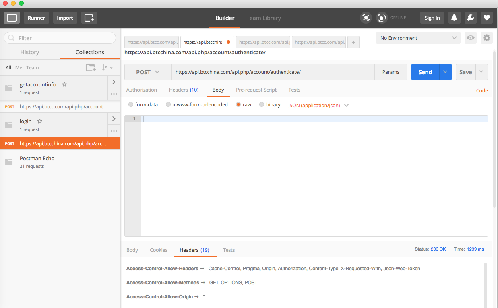
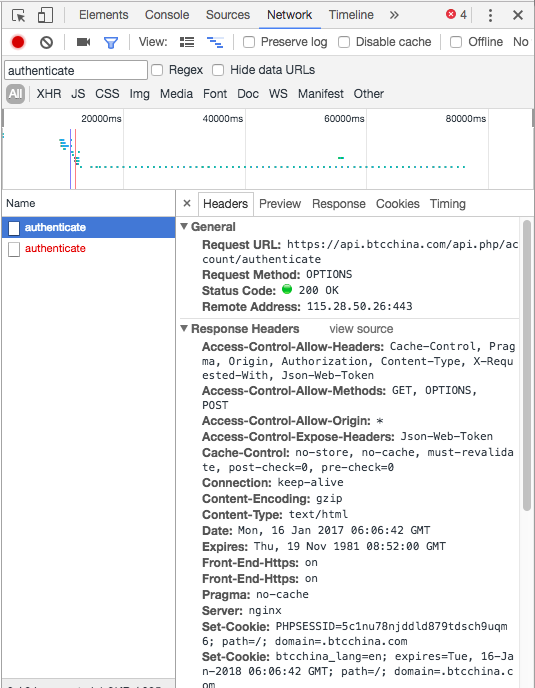
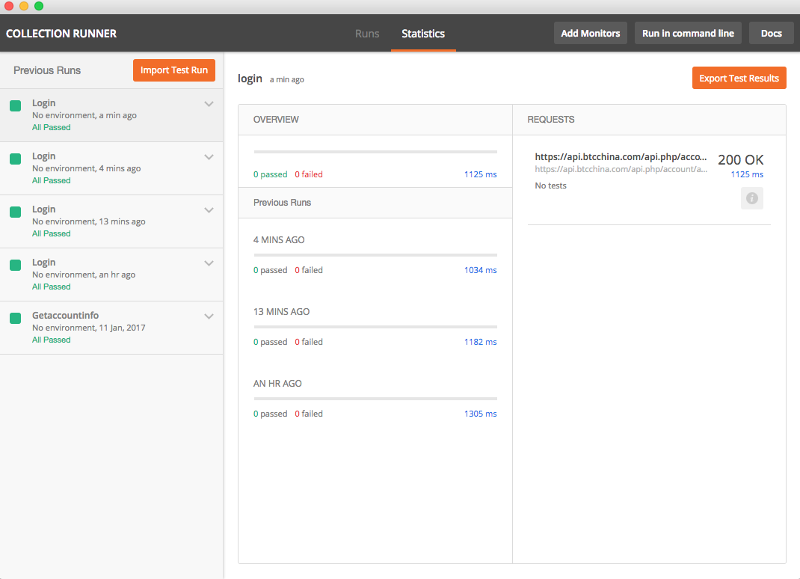
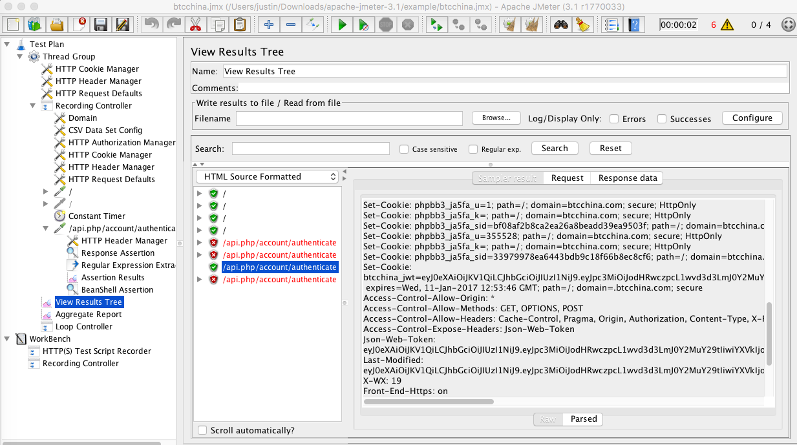
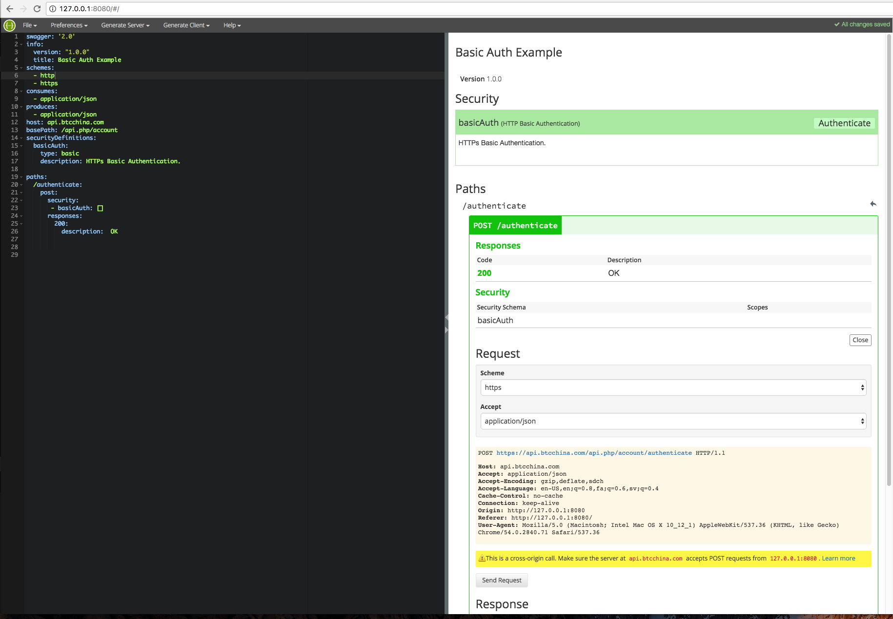
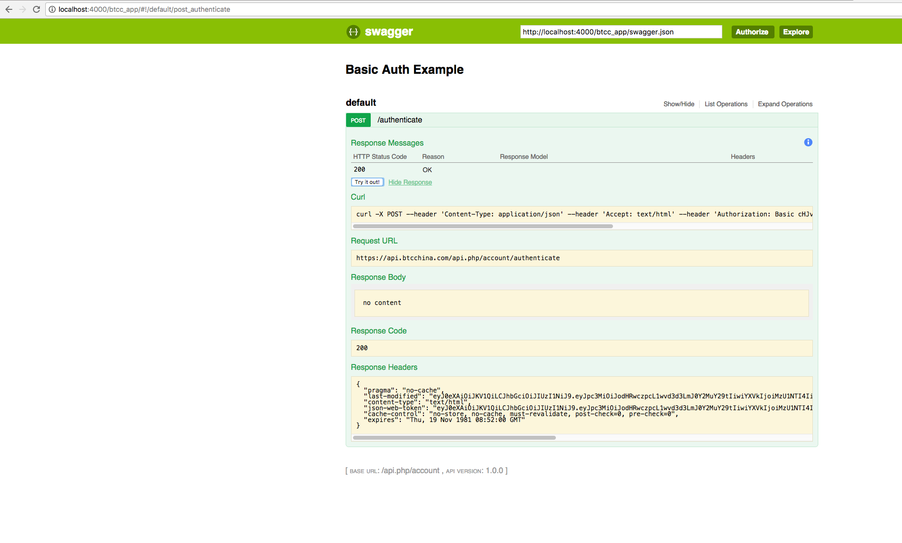

# 接口测试

这篇文章我会介绍几种常用的接口测试的方法，分别是Postman,Jmeter，Python Requests库以及Swagger。当然接口测试还有很多其他的方法，比如SOAPUI，我要介绍的四种是我自己亲自用过体验过的，所以可以介绍它们的方法和特性，我会在这篇文章中作出总结。当然由于我个人能力的原因，也许文中会有介绍得不够详细或者错误的地方，请大家多多指正。感谢大家！好，我们正式开始吧。

##一. Postman
Postman是一款功能强大的网页调试与发送网页HTTP请求的Chrome插件。它的界面如下：



我们可以看到这就是一个最普通的HTTP请求，由URL，Method，Header以及Body组成。对了，本文介绍的接口都是RESTful的接口，不涉及其他的接口。所以在这里也先介绍一下RESTful接口，基本有4种类型，分别是POST，PUT，GET和DELETE。好，我们回到Postman的主界面。我这个例子里URL就是登陆API，Method就是POST，这个request没有body，只有header。到这里，我想你一定会问，那我怎么知道这个API的URL，header或者Body的呢？也就是我怎么去抓取API？好问题，有两种方法：

第一，chrome的developer tools



看到没？你需要的所有信息都抓取下来了，URL，Method，header，body等。所以你只需要将对应的信息复制黏贴到Postman里就可以了。

第二，fiddler。它也是一款很棒的抓包工具，各位可以自己下下来玩。

OK，我们有了抓取API的工具，也有了Postman了，那就可以跑case了，就像这样。



你可以任意的选择case去跑，点击Statistics就可以看到状态了，而且还有响应时间。很好吧。

总结一下Postman的优缺点，它的优点包括即插即用，简单，界面也非常清晰干净，如果你想快速的验证某个API，那Postman是你的首选。再说一下它的缺点，你可以看到Postman的操作都是手动的，它不支持完全的自动化的测试。也就是你设计完测试用例后，组织成test suite然后就可以完全自动的去跑，这个它不支持。那自然它每次跑也都要由你决定，而不能持续的跑。

##二. Jmeter
关于Jmeter，其实它是一款性能测试的工具，当然你也完全可以拿它来做自动化测试和接口测试，它的功能非常强大，尤其是分布式的压测，它是首选。它的首页如下：



具体jmeter的用法在这篇文章里我就不介绍了，大家可以去我的github上看另外一篇文章。

这是地址：<https://github.com/dhutsj/jmeter>  。里面介绍了jmeter的用法。这篇文章里我想说的是jmeter应用在接口测试里的好处，最大的好处就是网页录制功能，也就是说，不管是哪个接口，你都可以通过jmeter的http代理服务器来抓取API，然后直接生产相应的test case。这就减少了你自己手写测试用例的麻烦，同时Jmeter也提供了非常好的组织test case的方式，那就是test plan。它的缺点就是各个组件非常复杂，对于初学者上手来说有一定难度，同时交互页面的友好性有待改进。最后就是它本身也有一些小小的bug。

##三. Python Requests库

Python requests库是我个人非常喜欢的一个python函数库，哈哈，估计你们都看出来了我是python的粉丝。好，requests库也是托管在github上的。

这是它的地址：<https://github.com/kennethreitz/requests>

大家可以看README来了解它的基本用法，好，那下面有我自己写的几个脚本,大家可以看一下怎样用requests库来发送http请求。

#### <a name="python-code-block">Python Code Block</a>

This is a python requests code block:

```
   headers = global_config.Login_headers
   r = requests.post(self.url, headers=headers)
   print r.headers.get('Last-Modified')
   print r.headers
   print r.text
   print r.content
```
非常简单是不是？你可以直接调用requests库的post方法，然后指定相应的参数即可，比如url, header, body。再结合python的json模块，你就可以很容易的得到response数据。同时利用这种方法，可以自己写一个持续集成的接口自动化测试框架出来。所以写到这里，你也许看出来了，我个人最推崇的就是python requests库来做接口测试。配合python multiprocess和multithreading库，连性能测试都一起做了，是不是一举两得？它的好处就是完全的自定义，缺点就是要自己动手写代码。对于不熟悉python的朋友来说会有点费力。

##四. Swagger

这是我最近才接触的一个接口管理以及自动化测试的框架。它有几个组件，最基本的两个，swagger editor和swagger UI。具体的部署步骤我不介绍了，如果有兴趣的朋友，可以发邮件给我。我们来看一下它的界面：





它是基于yaml语法的，你在swagger editor里编辑好相应的请求，然后将它导出到json文件中，再在swagger UI里展示。它的好处在于，你写完yaml导出的json文件就等于是你的API文档了，同时在UI里展现出来也非常美观，点击一下鼠标就可以完成所有你写的API的自动化测试。所以这个工具也非常好。我个人对它研究得还不是很深入，所以就写这么多。

最后，谢谢大家阅读这篇文章，希望对大家选择API自动化测试框架或者工具的时候有所启发和提示。当然由于我个人能力的原因，也许文中有错误的地方，请大家指正。这是我的个人邮箱，欢迎交流。
<dhutsj@gmail.com> 。再次感谢大家！


